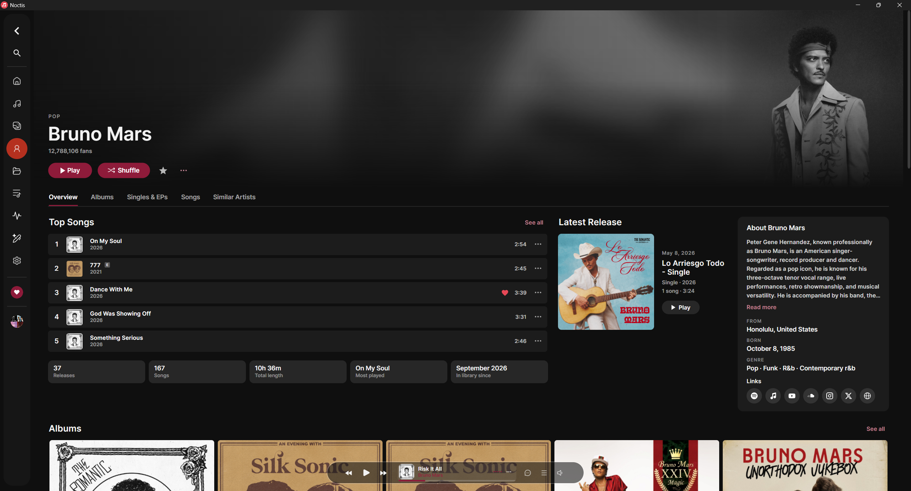
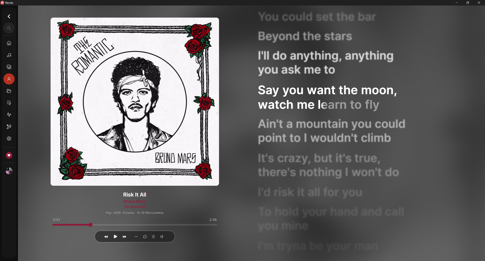
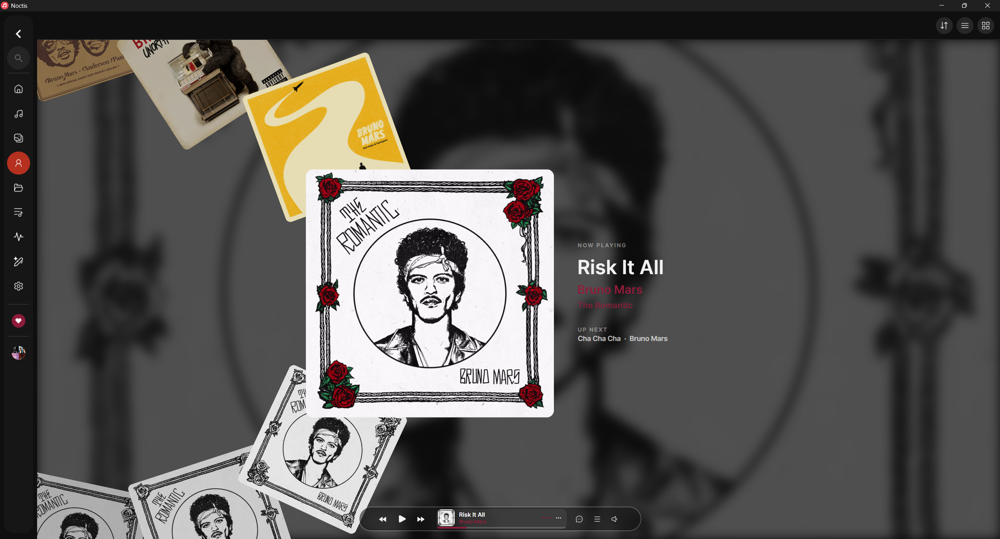
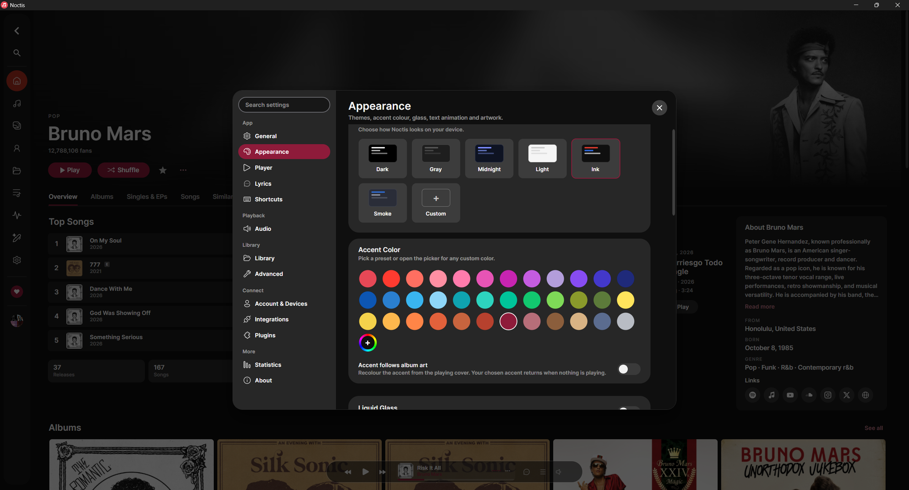

<div align="center">

<h1>
  &nbsp;Noctis
</h1>

**A music player that respects what's yours. Zero tracking, total control.**

[](https://discord.gg/BNCDZQUVx7) &nbsp; [](https://github.com/heartached/Noctis/releases) &nbsp; [](https://buymeacoffee.com/heartached)

[]()

</div>

---

## Screenshots

#### Artist pages



#### Word-by-word karaoke lyrics



#### Cover Flow



#### Themes & accent colors



---

## Install

**Windows**, via a package manager:

```powershell
# winget
winget install heartached.Noctis

# Scoop (add the bucket once, then install)
scoop bucket add noctis https://github.com/heartached/scoop-bucket
scoop install noctis
```

Or download the installer or portable zip from the
[latest release](https://github.com/heartached/Noctis/releases/latest).

**macOS and Linux**: download the `.dmg` or AppImage from the
[latest release](https://github.com/heartached/Noctis/releases/latest).
Both ship with everything they need, so there is nothing else to install.

**Self-hosting**: `noctis-server` is the same library scanner and OpenSubsonic API
without a window, for a NAS, a VPS or Docker. Grab `noctis-server-linux-x64.tar.gz`
or `noctis-server-linux-arm64.tar.gz` from the
[latest release](https://github.com/heartached/Noctis/releases/latest), or build the image:

```sh
docker build -t noctis-server .
docker run -d --name noctis -p 4747:4747 -v /path/to/music:/music:ro -v noctis-data:/data noctis-server
docker exec -it noctis /app/noctis-server user add alice
```

Options and client notes are in [docs/SELF-HOSTING.md](docs/SELF-HOSTING.md).

---

## Features

### Sound

- [x] Plays FLAC, ALAC, WAV, AIFF, APE, WavPack, MP3, AAC, OGG, Opus, WMA and M4A
- [x] Bit-perfect exclusive output on Windows
- [x] Parametric EQ with presets, and a saved preset per track if you want one
- [x] Gapless playback, crossfade and AutoMix transitions
- [x] ReplayGain and Sound Check volume leveling
- [x] Automatic BPM and musical key detection
- [x] Track Radio and Autoplay keep the music going when the queue runs out
- [x] Batch converter between formats (ffmpeg)
- [x] Audio CD playback
- [x] Multi-channel upmix, and pitch shift independent of playback speed
- [x] Spectrogram window and an audio visualizer (Bars, Mirror, Wave)

### Library

- [x] Songs, Albums, Artists, Folders and Playlists views
- [x] Albums split into Albums, Singles and EPs
- [x] Smart playlists, favorites, star ratings and play counts
- [x] Full metadata editor for artwork, lyrics and per-track options
- [x] Auto-tagging and cover art search using Deezer, MusicBrainz and Apple Music
- [x] Drag and drop import, watched folders, bulk edits
- [x] Playlist import from Exportify CSV, TuneMyMusic JSON and m3u files
- [x] Duplicate finder and file organizer
- [x] Command palette
- [x] Listening stats with a monthly and yearly Wrap
- [x] Artist pages with Top Songs, About, Similar Artists and fan counts from Deezer
- [x] Playlist and album import from TIDAL and Deezer links
- [x] Add from YouTube, Send to Folder, and Open with Noctis file associations
- [x] Explicit content toggle, with an Explicit badge on albums
- [x] Group Artists By with editable separators; drag and drop for playlists and the sidebar
- [x] Rebindable keyboard shortcuts

### Lyrics

- [x] Word-by-word karaoke lyrics, Apple Music style
- [x] Reads plain text, LRC, word-level LRC, TTML and Lyricsfile sidecars
- [x] Auto-fetched from LRCLIB and NetEase, cached offline
- [x] Lyrics panel you can keep open next to any page
- [x] Written By credits for the songwriters and producers
- [x] Built-in lyrics editor with `.lrc` export
- [x] Share lyrics as image cards or short clips
- [x] Lyrics Studio: speech-to-lyrics alignment on your own machine with Whisper
- [x] Video or GIF backgrounds on the lyrics page, per song or per album, and music videos in the artwork slot
- [x] Global lyrics offset and lyrics import from file

### Look and feel

- [x] Cover Flow browsing with Carousel, Cascade and Collage layouts
- [x] Now Playing artwork as a CD, a vinyl record or a cassette
- [x] Animated cover art
- [x] Ambient blurred backdrops on the lyrics page
- [x] Themes and accent colors, plus a custom theme editor
- [x] Liquid Glass translucent window mode
- [x] Resizable mini player with search, queue, volume and karaoke lyrics
- [x] Kawarp warped background, album pages tinted from the cover, accent color that can follow the album art
- [x] Settings organized into 13 searchable pages

### Connect

- [x] Stream from Jellyfin, Navidrome, Airsonic, Gonic or any Subsonic server
- [x] Built-in Noctis Server: stream your library to Symfonium, substreamer, Feishin or any Subsonic client
- [x] Self-hosted `noctis-server` for a NAS, a VPS or Docker, see [docs/SELF-HOSTING.md](docs/SELF-HOSTING.md)
- [x] Discord Rich Presence
- [x] Scrobble to Last.fm and ListenBrainz
- [x] Web remote so you can control playback from your phone
- [x] Media keys on every platform, plus Windows taskbar controls
- [x] Artist images from Deezer
- [x] Sleep timer, tray icon and launch at login
- [x] Updates itself from GitHub releases
- [x] Song progress on the Windows taskbar

### Languages

- [x] English, Arabic, French, Japanese, Korean, Spanish, Simplified Chinese and Traditional Chinese
- [x] Switch language from Settings without a restart

<p align="center">
  
</p>

---

## Plugins

Noctis can be extended three ways, from safest to most powerful:

- **Content packs**: themes, lyrics presets and languages as plain JSON, with no code. They keep working in restricted mode. See [Content packs](docs/PLUGINS.md#content-packs).
- **Local API**: HTTP + JSON on 127.0.0.1 for Stream Deck buttons, OBS overlays and scripts in any language. Nothing runs inside Noctis. See the [Local API reference](docs/LOCAL-API.md).
- **Plugins**: .NET libraries built on the `Noctis.Plugins.Abstractions` SDK, with a `plugin.json` manifest and permissions, installed from a .zip. See the [plugin guide](docs/PLUGINS.md).

Community plugins start off (restricted mode) and ask for approval before they run. Sample plugins, a sample content pack and Local API examples are in [`samples/`](samples/).

---

## Build

```bash
git clone https://github.com/heartached/Noctis
cd Noctis
dotnet run --project src/Noctis/Noctis.csproj
```

**Requirements:** .NET 10 SDK

Supported platforms: Windows 10/11 (x64), macOS 12+ (Intel and Apple Silicon), Linux (x64 and ARM64).

### Native dependency: libvlc

The released downloads already carry everything they need. This only matters if
you are building from source.

- **Windows:** bundled automatically via NuGet, nothing to install.
- **macOS:** install [VLC](https://www.videolan.org/vlc/), which Noctis loads from
  `/Applications/VLC.app`. Packaged release builds bundle their own copy of VLC
  inside the app, so a downloaded Noctis needs no VLC install.
  ```bash
  brew install --cask vlc
  ```
- **Linux:** install via your package manager. The `-dev` package provides the
  unversioned `libvlc.so` symlink that the .NET loader looks for. The released
  AppImage bundles libvlc and its plugins, so it runs without this.
  ```bash
  # Debian/Ubuntu
  sudo apt install libvlc-dev
  # Fedora
  sudo dnf install vlc-devel
  # Arch
  sudo pacman -S vlc
  ```

### Running a downloaded build (macOS / Linux)

The macOS and Linux artifacts on the [Releases page](https://github.com/heartached/Noctis/releases)
are unsigned self-contained builds.

**macOS**, using the portable zip:
```bash
unzip Noctis-osx-arm64.zip
xattr -dr com.apple.quarantine Noctis.app   # remove Gatekeeper quarantine flag
open Noctis.app
```

**Linux**, using the AppImage:
```bash
chmod +x Noctis-x86_64.AppImage
./Noctis-x86_64.AppImage
```

Or the portable tarball, which extracts without a top-level folder:
```bash
mkdir noctis && tar -xzf Noctis-linux-x64.tar.gz -C noctis
chmod +x noctis/Noctis
./noctis/Noctis
```

### Build for another OS

```bash
dotnet publish src/Noctis/Noctis.csproj -c Release -r linux-x64   --self-contained
dotnet publish src/Noctis/Noctis.csproj -c Release -r osx-arm64   --self-contained
dotnet publish src/Noctis/Noctis.csproj -c Release -r osx-x64     --self-contained
dotnet publish src/Noctis/Noctis.csproj -c Release -r linux-arm64 --self-contained
```

### Build the server

```bash
dotnet publish src/Noctis.Server/Noctis.Server.csproj -c Release -r linux-x64 --self-contained
docker build -t noctis-server .
```

---

## Star History

[](https://star-history.dera.page/#heartached/Noctis&Date)

---

## Feedback

If you have any feedback about bugs, feature requests, etc. about the app, please let me know through [issues](https://github.com/heartached/Noctis/issues).

Yours Truly, heartached.

---

## License

MIT, see [LICENSE](LICENSE)

---

> [!WARNING]
> Windows may flag the installer as untrusted because it isn't code-signed. This is normal for indie software and the app is safe to use.
